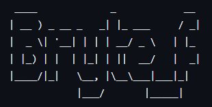
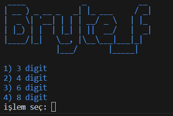

# bryte-f

<p align="center">
    
</p>

### Nedir
<i><b>Brute Force</b> saldırıları için gerekli olan wordlist'i oluşturmanıza yarayan bi programdır.Bu program 3,4,6,8 haneli dosyalar oluşturur.</i>

### Kurulum
```
git clone --depth=1 https://github.com/essekkat/bryte-f.git
```

```
cd bryte-f
```

```
pip install -r requiments.txt
```

```
python3 bryte-f
```
### Fotoğraf

<p>
    
</p>